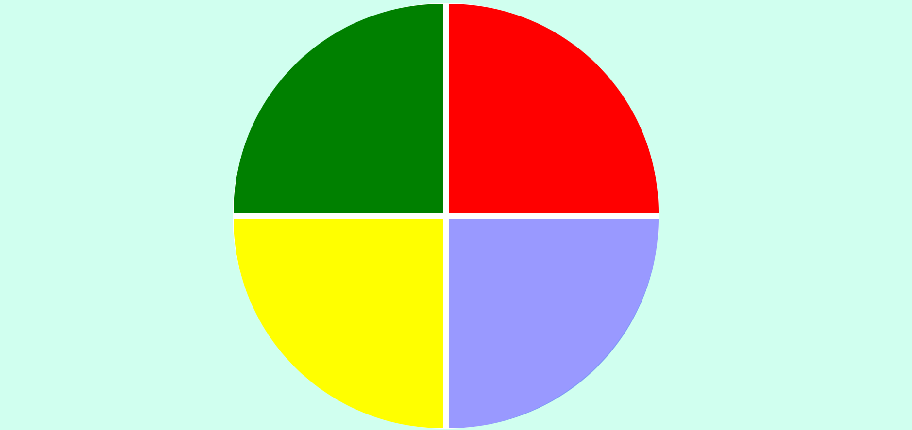

# Memory-Game-Genius
 Criação de um jogo da memória chamado Genius, que, apesar de ser um jogo relativamente simples, exercita as capacidades lógicas do trabalho com a linguagem JavaScript, e a estruturação e estilização com HTML e CSS.

- Visualização: 
